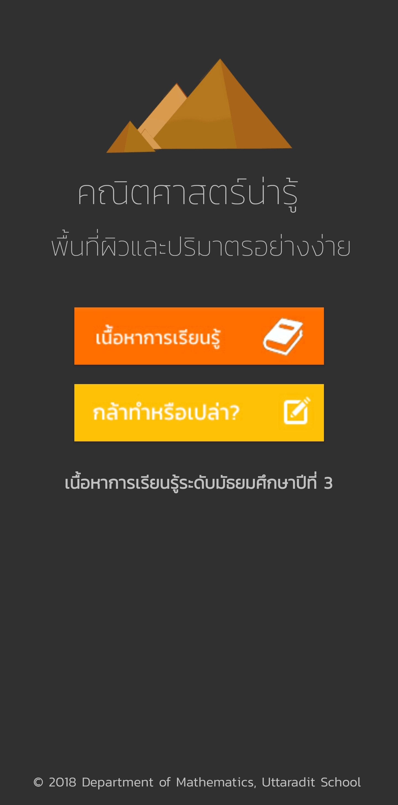
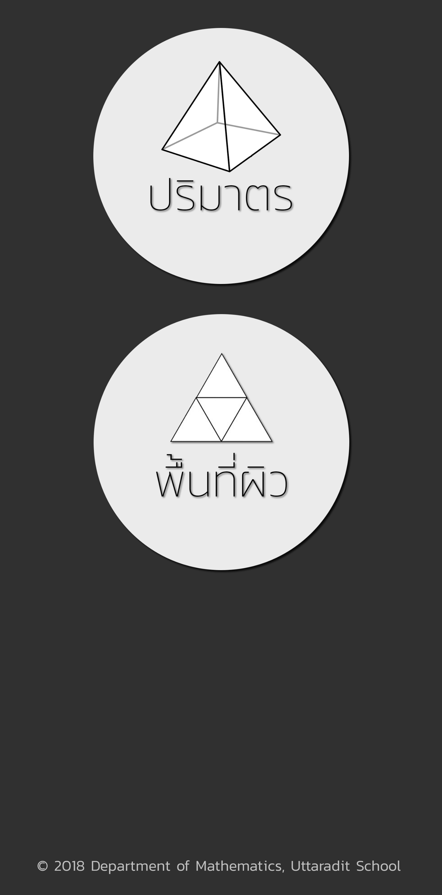
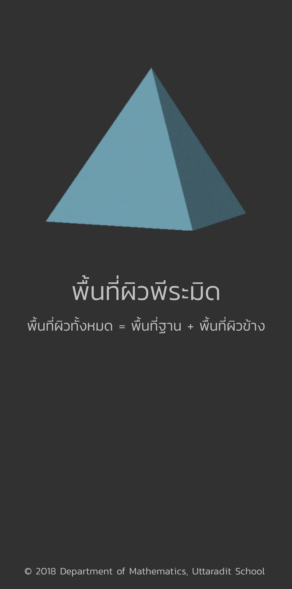
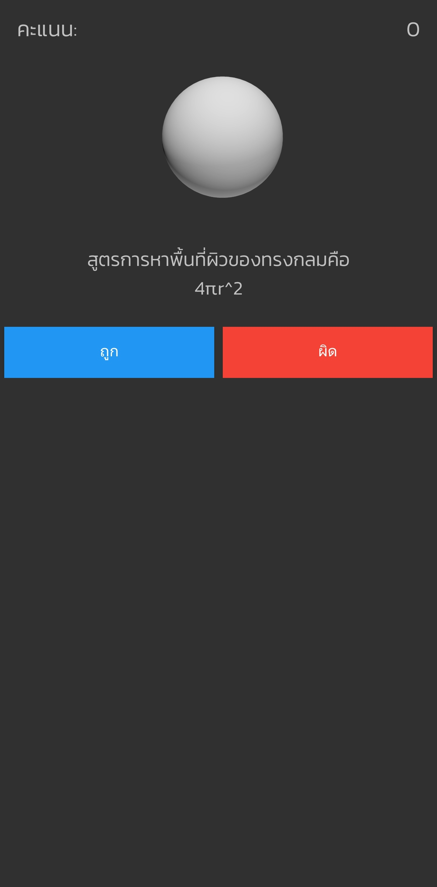

  
  <h3 align="center">Surface And Volume Geometry</h3>
  

    Android Application for Education, Developed by Uttaradit School Student
     
    <a href="https://utd.ac.th/"><strong>Uttaradit School »</strong></a>
  

# SurfaceAndVolumeGeometry
Developing Android Application for learning about Geometry Surface and Volume, Using Android Studio.

## Screenshots

